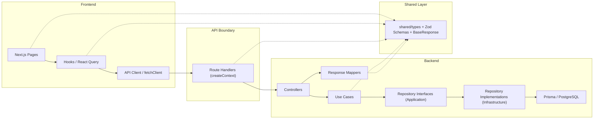
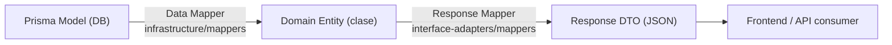
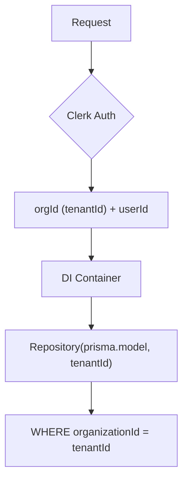
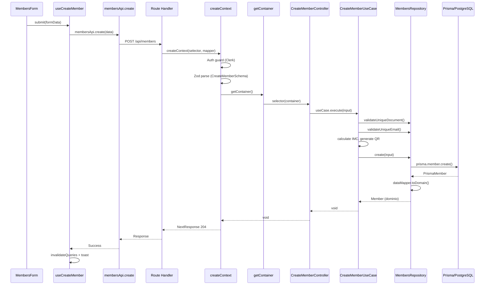

# Arquitectura y Patrones — IZI Gym SaaS

Documento detallado sobre la arquitectura, patrones de diseño, y prácticas utilizadas en el proyecto.

---

## 1. Visión General: Clean Architecture

El proyecto implementa **Clean Architecture** dividida en capas concéntricas con dependencias que apuntan siempre **hacia adentro** (de infraestructura → dominio). Se incluye además una **capa compartida** (`shared/`) que actúa como contrato neutral entre frontend y backend.



### Estructura de directorios

| Directorio | Capa | Responsabilidad |
|---|---|---|
| `server/domain/entities/` | **Dominio** | Entidades de negocio con lógica encapsulada |
| `server/domain/errors/` | **Dominio** | Jerarquía de errores (`AppError`) |
| `server/domain/types/` | **Dominio** | Input types del dominio (contratos internos) |
| `server/domain/interfaces/` | **Dominio** | Interfaces de servicios externos (`IBillingGateway`) |
| `server/domain/value-objects/` | **Dominio** | Value objects y configuraciones por defecto |
| `server/application/use-cases/` | **Aplicación** | Use cases: una clase, una responsabilidad |
| `server/application/repositories/` | **Aplicación** | Repository interfaces (contratos) |
| `server/application/services/` | **Aplicación** | Service interfaces (`IAuthProvider`, `IIMCCalculator`) |
| `server/application/dtos/` | **Aplicación** | Barrel re-exports desde `shared/types/` |
| `server/infrastructure/persistence/` | **Infraestructura** | Prisma repos, data mappers, error translator |
| `server/infrastructure/billing/` | **Infraestructura** | Adaptadores de facturación (`FacturadorProAdapter`) |
| `server/infrastructure/services/` | **Infraestructura** | Implementaciones de servicios (`ClerkAuthService`, `IMCCalculator`) |
| `server/interface-adapters/controllers/` | **Adaptadores** | Controllers: delegadores puros |
| `server/interface-adapters/mappers/` | **Adaptadores** | Response Mappers (dominio → DTO serializado) |
| `server/di/` | **Inyección** | Container y módulos de factory |
| `shared/types/` | **Compartida** | Zod schemas, tipos inferidos, `BaseResponse` |
| `shared/common/` | **Compartida** | Paginación genérica |
| `shared/utils/` | **Compartida** | Utilidades compartidas |
| `hooks/` | **Frontend** | Custom hooks por módulo (React Query) |
| `lib/api-client/` | **Frontend** | API clients tipados por entidad |
| `lib/react-query/` | **Frontend** | Query key factories, query client |
| `lib/nuqs/` | **Frontend** | Parsers de URL state por módulo |
| `components/` | **Frontend** | Componentes reutilizables (UI, layout, providers) |
| `app/(backend)/api/` | **Rutas API** | Next.js Route Handlers |
| `app/(frontend)/` | **Páginas** | Server/Client components |

> [!IMPORTANT]
> **Regla de imports estricta:** El frontend (`hooks/`, `lib/`, `app/(frontend)/`, `components/`) **nunca importa de `@/server/`**. Solo importa de `@/shared/types/`. Esto mantiene la separación entre capas.

---

## 2. Capa de Dominio (`server/domain/`)

### 2.1 Entidades con `BaseEntity` Genérica

Todas las entidades heredan de una clase abstracta con campos comunes y **soft-delete** integrado:

```typescript
// server/domain/entities/_base.ts
export abstract class BaseEntity<TStatus = EntityStatus | MembershipStatus> {
  constructor(
    public readonly id: string,
    public readonly organizationId: string,
    public readonly createdAt: Date,
    public readonly updatedAt: Date,
    public readonly status: TStatus,
    public readonly deletedAt?: Date | null,
  ) { }
}
```

**¿Por qué?** — Evita duplicar `id`, `organizationId`, `createdAt`, etc. en cada entidad. El genérico `TStatus` permite que `Membership` use su propio enum de estados (`ACTIVE | PENDING | EXPIRED | CANCELLED`).

#### Catálogo de Entidades

| Entidad | `TStatus` | Descripción |
|---|---|---|
| `Member` | `EntityStatus` | Socios del gimnasio con datos biométricos, QR y getters (`fullName`, `isLowStock`) |
| `Membership` | `MembershipStatus` | Membresías con plan, fechas inicio/fin, relación member/plan |
| `Plan` | `EntityStatus` | Planes de membresía (precio, duración, features) |
| `Product` | `EntityStatus` | Productos/servicios con stock, SKU, getters (`profitMargin`, `isLowStock`) |
| `User` | `EntityStatus` | Usuarios del sistema (staff) con roles |
| `Attendance` | `EntityStatus` | Registros de asistencia con método (QR/manual) y relación a member |
| `Organization` | `EntityStatus` | Organizaciones (tenants) con config, plan y slug |
| `OrganizationConfig` | `EntityStatus` | Configuración JSON extendida (branding, billing, booking, etc.) |
| `OrganizationPlan` | `EntityStatus` | Planes SaaS (Free, Pro, Enterprise) con límites y precios Stripe |
| `Subscription` | `EntityStatus` | Suscripciones Stripe con estado y período |
| `DashboardMetrics` | — | Interfaz (no entidad) para métricas agregadas |

**¿Por qué clases y no interfaces?** — Las clases permiten encapsular **lógica de dominio** (como `isLowStock`, `fullName`, `isActive`). La entidad no es un simple data container, tiene comportamiento.

### 2.2 Jerarquía de Errores con `AppError`

```typescript
// server/domain/errors/AppError.ts
export abstract class AppError extends Error {
  abstract readonly statusCode: number;
  abstract readonly code: string;
  readonly isOperational: boolean = true;

  toJSON() {
    return { message: this.message, code: this.code };
  }
}
```

Errores concretos en `server/domain/errors/common.ts`:

| Clase | HTTP | Uso |
|---|---|---|
| `NotFoundError` | 404 | Entidad no encontrada |
| `ConflictError` | 409 | Duplicados (email, documento) |
| `ValidationError` | 422 | Validación con campos detallados |
| `BadRequestError` | 400 | Input inválido |
| `UnauthorizedError` | 401 | Sin autenticación |
| `ForbiddenError` | 403 | Sin permisos |
| `ExternalServiceError` | 502 | Fallo en servicio externo (`isOperational: false`) |
| `InternalError` | 500 | Error inesperado (`isOperational: false`) |

**¿Por qué?** — El flag `isOperational` distingue errores esperados (reglas de negocio) de crashes reales. Solo los no-operacionales se logean a consola. El método `toJSON()` estandariza la respuesta al frontend.

### 2.3 Domain Types (Input DTOs del dominio)

```typescript
// server/domain/types/members.ts
export interface CreateMemberInput {
  firstName: string;
  lastName: string;
  docType: DocType;
  docNumber: string;
  email?: string | null;
  // ...
}

export interface UpdateMemberInput extends Partial<CreateMemberInput> {
  isActive?: boolean;
}
```

Define el contrato de datos que el dominio acepta, independiente de la validación HTTP/Zod. Existen archivos de tipos para cada módulo: members, memberships, plans, products, users, attendance, dashboard, organizations, subscription y system.

### 2.4 Domain Interfaces (Ports de salida)

Interfaces en `server/domain/interfaces/` que definen contratos para servicios externos:

```typescript
// server/domain/interfaces/billing.gateway.ts
export interface IBillingGateway {
  emitInvoice(payload: InvoicePayload, apiUrl: string, token: string): Promise<BillingSuccessResponse>;
}
```

Incluye también los value types `InvoicePayload`, `InvoiceItem` y `BillingSuccessResponse`. La implementación real (`FacturadorProAdapter`) vive en infraestructura.

### 2.5 Value Objects

```typescript
// server/domain/value-objects/organizations-config.default.ts
export const defaultOrganizationConfig = () => ({
  identity: { website: null, locale: "es-PE", timezone: "America/Lima", currency: "PEN", ... },
  branding: { primary_color: null, font_family: null, logo_url: null, ... },
  billing:  { tax_settings: { enabled: true, tax_name: "IGV", tax_rate: 0.18, ... }, ... },
  booking:  { booking_window_days: 7, waitlist: { enabled: true, ... }, ... },
  accessControl: { check_in_method: ["qr", "manual"], anti_passback: true, ... },
  notifications: { channels: { email: false, sms: false, push: false, ... }, ... },
  features: { gamification: { ... }, workouts: { ... }, ecommerce: { ... } },
  staffSettings: { require_2fa: false, trainers_can_view_revenue: false, ... },
});
```

**¿Por qué?** — Centraliza la configuración por defecto de cada organización. Al crear una nueva org, se usa este template garantizando consistency.

---

## 3. Capa de Aplicación (`server/application/`)

### 3.1 Repository Interfaces — Contratos genéricos

```typescript
// server/application/repositories/base.repository.interface.ts
export interface IBaseRepository<TEntity, TCreate, TUpdate, TFilters = unknown> {
  findAll(request: PageableRequest<TFilters>): Promise<PageableResponse<TEntity>>;
  findById(id: string): Promise<TEntity | null>;
  findUnique(args: Partial<TEntity>): Promise<TEntity | null>;
  create(data: TCreate): Promise<TEntity>;
  update(id: string, data: TUpdate): Promise<TEntity>;
  delete(id: string): Promise<void>;
  restore(id: string): Promise<void>;
}
```

Las interfaces concretas extienden y agregan métodos específicos:

```typescript
// server/application/repositories/members.repository.interface.ts
export interface IMembersRepository extends IBaseRepository<
  Member, CreateMemberInput, UpdateMemberInput, MembersFilters
> {
  validateUniqueDocument(docType: string, docNumber: string): Promise<Member | null>;
  validateUniqueEmail(email: string | null | undefined): Promise<Member | null>;
  findByIdWithMemberships(id: string): Promise<Member | null>;
  findByQrCode(qrCode: string): Promise<Member | null>;
}
```

#### Repositorios disponibles

| Interfaz | Métodos especiales |
|---|---|
| `IMembersRepository` | `validateUniqueDocument`, `validateUniqueEmail`, `findByQrCode` |
| `IMembershipsRepository` | Filtros por estado, relaciones con member/plan |
| `IPlansRepository` | Filtros por actividad |
| `IProductsRepository` | Filtros por tipo, stock |
| `IUsersRepository` | Validaciones de unicidad |
| `IAttendanceRepository` | Filtros por fecha, método |
| `IOrganizationsRepository` | `findBySlug`, settings, plan upgrade |
| `IDashboardRepository` | Métricas agregadas, revenue |
| `ISubscriptionRepository` | Estado de suscripción Stripe |
| `ISystemRepository` | Stats globales, config del sistema, planes SaaS |

### 3.2 Service Interfaces

Contratos para servicios transversales que viven en `server/application/services/`:

```typescript
// server/application/services/auth-provider.interface.ts
export interface IAuthProvider {
  getUserById(id: string): Promise<{ email: string; imageUrl: string } | null>;
  inviteUserToOrganization(data: { email: string; role: Role; organizationId: string; inviterUserId: string }): Promise<void>;
  getSession(): Promise<{ userId: string; orgId: string } | null>;
  getClient(): Promise<any>;
}
```

```typescript
// server/application/services/imc-calculator.interface.ts
export interface IIMCCalculator {
  calculate(weight: number, height: number): number;
}
```

**¿Por qué?** — Dependency Inversion. Los use cases dependen de abstracciones (`IAuthProvider`), no de implementaciones concretas (`ClerkAuthService`). Se puede cambiar de proveedor de auth sin tocar lógica de negocio.

### 3.3 Use Cases — Una clase, una responsabilidad

Cada operación de negocio es un use case independiente con un método `execute()`:

```typescript
// server/application/use-cases/members/create-member.use-case.ts
export class CreateMemberUseCase {
  constructor(
    private readonly repo: IMembersRepository,
    private readonly imcCalculator: IIMCCalculator
  ) { }

  async execute(input: CreateMemberInput): Promise<void> {
    // 1. Validaciones de negocio
    const errors: string[] = [];
    if (await this.repo.validateUniqueDocument(input.docType, input.docNumber))
      errors.push("El número de documento ya esta en uso");
    if (await this.repo.validateUniqueEmail(input.email))
      errors.push("El correo electrónico ya esta en uso");
    if (errors.length > 0) throw new ConflictError(errors.join(" . "));

    // 2. Lógica de dominio
    if (input.height && input.weight) {
      input.imc = this.imcCalculator.calculate(input.weight, input.height);
    }
    input.qr = generateMemberQrToken();

    // 3. Persistencia
    await this.repo.create(input);
  }
}

// Patrón para extraer el tipo de instancia
export type ICreateMemberUseCase = InstanceType<typeof CreateMemberUseCase>;
```

**¿Por qué `InstanceType<typeof ...>`?** — Evita crear una interfaz separada para cada use case. TypeScript infiere automáticamente la estructura de la clase.

#### Módulos de Use Cases

| Módulo | Use Cases | Descripciones clave |
|---|---|---|
| `members/` | 7 | CRUD + restore + getByQrCode |
| `memberships/` | 7 | CRUD + restore + cancel |
| `plans/` | 6 | CRUD + restore |
| `products/` | 6 | CRUD + restore |
| `users/` | 6 | CRUD + restore |
| `attendance/` | 5 | CRUD + register |
| `organizations/` | 7 | CRUD + settings + plan upgrade |
| `dashboard/` | 2 | Métricas + histórico |
| `system/` | 10 | Stats, orgs, config, planes SaaS |

### 3.4 DTOs — Re-exportación desde shared

```typescript
// server/application/dtos/members.dto.ts
export * from "@/shared/types/members.types";
```

**¿Por qué?** — Los DTOs reales (Zod schemas + tipos inferidos) viven en `shared/types/`. El archivo en `application/dtos/` actúa como barrel export para que los imports internos del backend sean consistentes, mientras el frontend importa directamente de `shared/`.

---

## 4. Capa de Infraestructura (`server/infrastructure/`)

### 4.1 Data Mapper Pattern (Persistence Mappers)

```typescript
// server/infrastructure/persistence/mappers/IMapper.interface.ts
export interface IMapperInterface<TEntity, TPersistence> {
  toDomain(raw: TPersistence): TEntity;
  toPersistence(domain: TEntity): any;
}
```

Cada entidad tiene su mapper que traduce entre el modelo Prisma y la entidad de dominio:

```typescript
// server/infrastructure/persistence/mappers/members.mapper.ts
export class MemberMapper implements IMapperInterface<Member, ...> {
  toDomain(raw: PrismaMember): Member {
    return new Member(
      raw.id, raw.organizationId, raw.createdAt, raw.updatedAt,
      raw.status as EntityStatus, raw.deletedAt,
      raw.firstName, raw.lastName, raw.docType as DocType,
      // ...
    );
  }
}
```

**Mappers disponibles:** `MemberMapper`, `MembershipMapper`, `PlanMapper`, `ProductMapper`, `UserMapper`, `AttendanceMapper`, `OrganizationMapper`, `OrganizationPlanMapper`, `SubscriptionMapper`.

**¿Por qué?** — Aísla la estructura de Prisma del dominio. Si Prisma cambia su API o se migra a otro ORM, solo cambian los mappers.

### 4.2 Base Repository — Template Method Pattern

La clase abstracta `BaseRepository` implementa el CRUD genérico y define un **hook abstracto** `buildPrismaClauses()` que cada repositorio concreto implementa:

```typescript
// server/infrastructure/persistence/repositories/base.repository.ts
export abstract class BaseRepository<D extends PrismaDelegate, TEntity, TCreate, TUpdate, TFilters>
  implements IBaseRepository<TEntity, TCreate, TUpdate, TFilters> {

  constructor(
    protected readonly model: D,
    protected readonly mapper: IMapperInterface<TEntity, any>,
    protected readonly organizationId?: string,
    protected readonly entityName: string = "Entidad",
  ) { }

  // Template Method: cada repo define cómo construir WHERE + ORDER BY
  protected abstract buildPrismaClauses(filters: TFilters): Promise<[any, any]>;

  async findAll(request) { /* usa buildPrismaClauses() + paginación */ }
  async create(data)     { /* auto-inject organizationId */ }
  async delete(id)       { /* soft-delete: isActive=false, deletedAt=new Date() */ }
  async restore(id)      { /* isActive=true, deletedAt=null */ }
}
```

#### Soft Delete con prefijo para unicidad

```typescript
// Para campos con unique constraint al soft-delete:
protected softDelete = (value: string | null | undefined): string | null => {
  if (!value) return null;
  return `deletedAt_${Date.now()}_${value}`;  // "deletedAt_1708234567_user@email.com"
};

protected restoreField = (value: string | null | undefined): string | null => {
  if (!value) return null;
  return value.replace(/^deletedAt_\d+_/, '');  // restaura "user@email.com"
};
```

**¿Por qué?** — Al hacer soft-delete, si `email` tiene unique constraint, un nuevo usuario no podría usar ese email. El prefijo temporal "libera" el valor sin perder la referencia original.

### 4.3 Prisma Error Translator

```typescript
// server/infrastructure/persistence/prisma-error-translator.ts
export function translatePrismaError(error: unknown, context?: string): never {
  if (error instanceof Prisma.PrismaClientKnownRequestError) {
    switch (error.code) {
      case "P2002": throw new ConflictError(`Ya existe un registro con ese ${fields}`);
      case "P2003": throw new ConflictError("Tiene registros asociados");
      case "P2025": throw new NotFoundError(`${context} no encontrado`);
      // ...
    }
  }
}
```

**¿Por qué?** — Traduce errores técnicos de Prisma a errores semánticos del dominio. El use case y el controller nunca ven `P2002`, solo ven `ConflictError`.

### 4.4 Billing Adapter (Adapter Pattern)

```typescript
// server/infrastructure/billing/facturadorpro.adapter.ts
export class FacturadorProAdapter implements IBillingGateway {
  async emitInvoice(data: InvoicePayload, apiUrl: string, token: string): Promise<BillingSuccessResponse> {
    // Mapea InvoicePayload del dominio al formato JSON de Facturador Pro
    // Realiza la petición HTTP al servicio externo
    // Convierte la respuesta al tipo BillingSuccessResponse del dominio
  }
}
```

**¿Por qué Adapter Pattern?** — Desacopla el formato específico de Facturador Pro del dominio. Si se cambia a otro proveedor de facturación, solo se crea un nuevo adapter que implemente `IBillingGateway`.

### 4.5 Auth Service (Clerk)

```typescript
// server/infrastructure/services/clerk-auth.service.ts
export class ClerkAuthService implements IAuthProvider {
  async getSession(): Promise<{ userId: string; orgId: string } | null> { /* Clerk auth */ }
  async inviteUserToOrganization(data): Promise<void> { /* Clerk org invitations */ }
  async getUserById(id: string): Promise<{ email: string; imageUrl: string } | null> { /* Clerk users */ }
  async getClient() { return clerkClient(); }
}
```

---

## 5. Interface Adapters

### 5.1 Controllers — Delegadores puros

Los controllers reciben input, lo pasan al use case, devuelven resultado.

```typescript
// server/interface-adapters/controllers/members/create-member.controller.ts
export class CreateMemberController implements ControllerExecutor<CreateMemberInput, void> {
  constructor(private readonly useCase: ICreateMemberUseCase) { }

  async execute(input: CreateMemberInput): Promise<void> {
    await this.useCase.execute(input);
  }
}
```

Implementan la interfaz `ControllerExecutor<TInput, TResult>` definida en `api-handler.ts`:

```typescript
export type ControllerExecutor<TInput = void, TResult = unknown> = {
  execute: (input: TInput, id?: string) => Promise<TResult>;
};
```

**¿Por qué tan simples?** — El controller no tiene lógica. La validación la hace Zod en la ruta, la lógica de negocio la hace el use case. El controller solo conecta ambos.

### 5.2 Response Mappers — Serialización de dominio a DTO

> [!IMPORTANT]
> Este es un patrón nuevo que complementa los Data Mappers de infraestructura. Mientras los **Data Mappers** convierten `Prisma Model → Domain Entity`, los **Response Mappers** convierten `Domain Entity → Response DTO`.

```typescript
// server/interface-adapters/mappers/member-response.mapper.ts
export class MemberResponseMapper {
  static toResponse(entity: Member): MemberResponse {
    return {
      id: entity.id,
      organizationId: entity.organizationId,
      firstName: entity.firstName,
      fullName: entity.fullName,           // getter computado
      createdAt: entity.createdAt.toISOString(),  // Date → string
      updatedAt: entity.updatedAt.toISOString(),
      deletedAt: entity.deletedAt?.toISOString() ?? null,
      // ...
    };
  }

  static toResponseArray(entities: Member[]): MemberResponse[] {
    return entities.map(this.toResponse);
  }
}
```

**¿Por qué?** — Serializa las entidades de dominio (con `Date`, getters, etc.) a DTOs planos con tipos serializables (`string` en vez de `Date`). Los **Response Mappers** viven en `interface-adapters/mappers/` porque pertenecen a la capa de presentación, no a infraestructura.

#### Flujo completo de datos:



**Response Mappers disponibles:** `MemberResponseMapper`, `MembershipResponseMapper`, `PlanResponseMapper`, `ProductResponseMapper`, `UserResponseMapper`.

---

## 6. DI Container — Factory Functions con `cache()`

### 6.1 Módulos de Factory

Cada dominio tiene su módulo que ensambla la cadena de dependencias:

```typescript
// server/di/modules/members.module.ts
export function createMembersModule(prisma: PrismaClient, tenantId: string) {
  // 1. Infraestructura
  const membersRepository = new MembersRepository(prisma.member, tenantId);
  const imcCalculator = new IMCCalculator();
  const responseMapper = new MemberResponseMapper();

  // 2. Use Cases (dependen de repos)
  const createMemberUseCase = new CreateMemberUseCase(membersRepository, imcCalculator);
  const deleteMemberUseCase = new DeleteMemberUseCase(membersRepository);
  // ...

  // 3. Controllers (dependen de use cases)
  const createMemberController = new CreateMemberController(createMemberUseCase);
  const deleteMemberController = new DeleteMemberController(deleteMemberUseCase);
  // ...

  return { createMemberController, deleteMemberController, /* ... */ };
}
```

#### Módulos registrados

| Módulo | Controllers | Notas |
|---|---|---|
| `attendances.module.ts` | 5 | CRUD + register |
| `dashboard.module.ts` | 2 | Métricas + histórico |
| `members.module.ts` | 7 | CRUD + restore + QR |
| `memberships.module.ts` | 7 | CRUD + restore + cancel |
| `organizations.module.ts` | 8 | CRUD + settings + plan upgrade |
| `plans.module.ts` | 6 | CRUD + restore |
| `products.module.ts` | 6 | CRUD + restore |
| `users.module.ts` | 6 | CRUD + restore (recibe `userId`) |
| `system.module.ts` | 10 | Stats, config, planes SaaS (sin `tenantId`) |

### 6.2 Container raíz con `cache()` de React

```typescript
// server/di/container.ts
export const getContainer = cache(async () => {
  const { orgId, userId } = await auth();     // Clerk auth
  const tenantId = orgId ?? "";

  const attendanceModule = createAttendanceModule(prisma, tenantId);
  const dashboardModule = createDashboardModule(prisma, tenantId);
  const membersModule = createMembersModule(prisma, tenantId);
  const membershipsModule = createMembershipsModule(prisma, tenantId);
  const organizationsModule = createOrganizationsModule(prisma, tenantId);
  const plansModule = createPlansModule(prisma, tenantId);
  const productsModule = createProductsModule(prisma, tenantId);
  const usersModule = createUsersModule(prisma, tenantId, userId ?? "");
  const systemModule = createSystemModule();  // Sin tenantId (GOD MODE)

  return {
    // ~57 controllers expuestos
    getAllMembersController: membersModule.getAllMembersController,
    createMemberController: membersModule.createMemberController,
    // ...
  };
});
```

**¿Por qué `cache()`?** — `cache()` de React memoiza por request. Garantiza que en una misma petición HTTP, `getContainer()` se ejecuta **una sola vez**, evitando re-crear repositorios y re-autenticar.

**¿Por qué no un framework de DI?** — El ensamblaje manual es más explícito, no requiere decorators ni reflection, y funciona perfectamente en el modelo de Next.js donde cada request es independiente.

> [!NOTE]
> El módulo `system` se crea **sin `tenantId`** porque opera a nivel global (panel de super-admin). El módulo `users` recibe además el `userId` del session para operaciones que requieren contexto del usuario actual.

---

## 7. API Handler Factory — `createContext()`

El patrón más poderoso del backend. Un factory function que genera Route Handlers de Next.js con auth, parsing, DI y error handling centralizados:

```typescript
// server/lib/api-handler.ts
export const createContext = <TInput = void, TResult = unknown>(
  selector: (container: Container) => ControllerExecutor<TInput, TResult>,
  requestMapper?: (req: NextRequest, params?) => TInput | Promise<TInput>,
  options?: { isPublic?: boolean; paramKey?: string }
) => {
  return async (req: NextRequest, props) => {
    // A. Auth guard (Clerk)
    // B. Resolver params (Next 15 async params)
    // C. Construir input via requestMapper (o undefined para GET/DELETE)
    // D. Obtener container (DI)
    // E. Seleccionar y ejecutar controller
    // F. Respuesta inteligente (200 JSON, 204 vacío, o NextResponse custom)
    // G. Error handling centralizado (AppError, ZodError, PrismaError P2002/P2003)
  };
};
```

Uso en las rutas — **extremadamente declarativo**:

```typescript
// app/(backend)/api/members/route.ts

// GET /api/members — con filtros
export const GET = createContext(
  (c) => c.getAllMembersController,
  async (req) => {
    const { page, limit } = parsePagination(req);
    const { search, sort, status } = Object.fromEntries(req.nextUrl.searchParams.entries());
    return { page, limit, filters: { search, sort, status } };
  },
);

// POST /api/members — con validación Zod
export const POST = createContext(
  (c) => c.createMemberController,
  async (req) => CreateMemberSchema.parse(await req.json()),
);
```

```typescript
// app/(backend)/api/members/id/[id]/route.ts

export const GET = createContext((c) => c.getMemberByIdController);  // sin mapper
export const DELETE = createContext((c) => c.deleteMemberController); // sin mapper
export const PATCH = createContext(
  (c) => c.updateMemberController,
  async (req) => UpdateMemberSchema.parse(await req.json()),
);
```

**¿Por qué?** — Una ruta CRUD entera en ~15 líneas. El auth, error handling, DI, y response formatting son automáticos. Agregar un nuevo endpoint es solo elegir controller + mapper.

---

## 8. Shared Layer — Zod + Types como fuente de verdad

### 8.1 Zod Schemas + Tipos inferidos

```typescript
// shared/types/members.types.ts
const MemberBaseSchema = z.object({
  firstName: z.string().min(2).trim().transform(capitalizeText),
  lastName: z.string().min(2).trim().transform(capitalizeText),
  docType: z.nativeEnum(DocType),
  docNumber: z.string().min(1).trim(),
  email: optionalEmail,    // preprocessed para null/""
  phone: optionalPhone,    // regex: /^9\d{8}$/
  birthDate: z.coerce.date().refine(age >= 5),
  // ...
});

// Validación cross-field
const validateDocuments = (data, ctx) => {
  if (data.docType === DocType.DNI && data.docNumber.length !== 8) {
    ctx.addIssue({ path: ["docNumber"], message: "El DNI debe tener 8 dígitos" });
  }
};

export const CreateMemberSchema = MemberBaseSchema.superRefine(validateDocuments);
export const UpdateMemberSchema = MemberBaseSchema.partial().omit({ docType: true, docNumber: true });

// Los TIPOS se infieren del schema — Single Source of Truth
export type CreateMemberInput = z.infer<typeof CreateMemberSchema>;
export type UpdateMemberInput = z.infer<typeof UpdateMemberSchema>;
```

**¿Por qué `UpdateSchema = Base.partial().omit()`?** — Partial hace todos los campos opcionales (PATCH), y omit quita campos que no deben poder editarse (docType, docNumber).

### 8.2 Base Entity y BaseResponse (para frontend)

```typescript
// shared/types/common.types.ts
export interface BaseEntity {
  id: string;
  organizationId: string;
  createdAt: Date;
  updatedAt: Date;
  status: EntityStatus | MembershipStatus;
  deletedAt?: Date | null;
}

export interface BaseResponse {
  id: string;
  organizationId: string;
  createdAt: string;      // string (ISO serializado)
  updatedAt: string;      // string (ISO serializado)
  status: EntityStatus | MembershipStatus;
  deletedAt?: string | null;
}
```

**¿Por qué dos interfaces?** — `BaseEntity` representa datos con tipos nativos (`Date`). `BaseResponse` representa datos serializados (`string`) que llegan del API. El frontend usa `BaseResponse` (y derivados como `MemberResponse`) porque las fechas llegan como strings en JSON.

### 8.3 Archivos de tipos

| Archivo | Descripción |
|---|---|
| `common.types.ts` | `BaseEntity`, `BaseResponse`, `EntityStatus` |
| `members.types.ts` | Schemas Zod + `MemberResponse` + `MembersFilters` |
| `memberships.types.ts` | `MembershipStatus`, schemas, filters |
| `plans.types.ts` | Schemas + `PlanResponse` |
| `products.types.ts` | `ProductType`, schemas + filters |
| `users.types.ts` | `Role`, schemas + `UserResponse` |
| `attendance.types.ts` | Schemas + `AttendanceResponse` |
| `organizations.types.ts` | Configuración extensa (8 secciones), schemas |
| `organization-plans.types.ts` | Schemas de planes SaaS |
| `subscription.types.ts` | `SubscriptionStatus` |
| `dashboard.types.ts` | Métricas y mapeo de respuesta |
| `system.types.ts` | Schemas del panel de super-admin |
| `errors.types.ts` | Tipos de error para el frontend |
| `pagination.types.ts` | `PageableRequest<T>`, `PageableResponse<T>` |

### 8.4 Paginación genérica

```typescript
// shared/types/pagination.types.ts
export interface PageableRequest<TFilters> {
  page: number;
  limit: number;
  filters?: TFilters;
}

export interface PageableResponse<T> {
  currentPage: number;
  pageSize: number;
  totalRecords: number;
  totalPages: number;
  hasNext: boolean;
  hasPrevious: boolean;
  records: T[];
}
```

---

## 9. Frontend — Data Fetching Architecture

### 9.1 API Client Layer

Fetch wrapper tipado con error handling:

```typescript
// lib/fetch-client.ts
export class ApiClientError extends Error {
  code: string;
  fields?: Record<string, string[]>;
}

export const fetchClient = async <T>(endpoint: string, options?: RequestInit): Promise<T> => {
  const response = await fetch(url, { cache: 'no-store', ...options });
  if (!response.ok) {
    const errorBody = await response.json().catch(() => ({}));
    throw new ApiClientError(errorBody.message, errorBody.code, errorBody.fields);
  }
  if (response.status === 204) return null as T;
  return response.json();
};
```

API clients por entidad — object literal con métodos tipados:

```typescript
// lib/api-client/members.api.ts
export const membersApi = {
  getAll:   (params) => fetchClient<PageableResponse<MemberResponse>>(endpoint),
  getById:  (id)     => fetchClient<MemberResponse>(`/api/members/id/${id}`),
  getByQrCode: (qr)  => fetchClient<MemberResponse>(`/api/members/qr/${qr}`),
  create:   (data)   => fetchClient<MemberResponse>("/api/members", { method: "POST", ... }),
  update:   (id, data) => fetchClient<MemberResponse>(`/api/members/id/${id}`, { method: "PATCH", ... }),
  delete:   (id)     => fetchClient<void>(`/api/members/id/${id}`, { method: "DELETE" }),
  restore:  (id)     => fetchClient<MemberResponse>(`/api/members/id/${id}/restore`, { method: "POST" }),
};
```

> [!NOTE]
> Los API clients ahora usan `MemberResponse` (DTO serializado) en vez de la entidad `Member` del dominio, alineándose con la regla de imports estricta.

**API clients disponibles:** `membersApi`, `membershipsApi`, `plansApi`, `productsApi`, `usersApi`, `attendanceApi`, `dashboardApi`, `organizationsApi`, `systemApi`.

### 9.2 React Query — Query Key Factories

Patrón de TkDodo para estructurar query keys jerárquicamente:

```typescript
// lib/react-query/query-keys.ts
export const memberKeys = {
  all: ['members'] as const,
  lists: () => [...memberKeys.all, 'list'] as const,
  list: (filters) => [...memberKeys.lists(), removeEmptyParams(filters)] as const,
  details: () => [...memberKeys.all, 'detail'] as const,
  detail: (id: string) => [...memberKeys.details(), id] as const,
};
```

**¿Por qué?** — Permite invalidación precisa:
- `memberKeys.all` → invalida todo de members
- `memberKeys.lists()` → invalida solo listas (no detalles)
- `memberKeys.detail(id)` → invalida solo un miembro específico

### 9.3 Custom Hooks — Cada operación es un hook

```typescript
// hooks/members/use-members.ts

// QUERIES
export const useMembersList = (params) => useQuery({
  queryKey: memberKeys.list(params),
  queryFn: () => membersApi.getAll(params),
  placeholderData: keepPreviousData,     // evita flash mientras pagina
});

// MUTATIONS con Optimistic Updates
export const useUpdateMember = () => {
  const queryClient = useQueryClient();
  return useMutation<MemberResponse, ApiClientError, { id; data }, MembersContext>({
    mutationFn: ({ id, data }) => membersApi.update(id, data),
    onMutate: async ({ id, data }) => {
      // 1. Cancelar queries en vuelo
      // 2. Snapshot para rollback
      // 3. Actualización optimista
      return { previousMembers };
    },
    onError: (error, _vars, context) => {
      // 4. Rollback en error
      context?.previousMembers.forEach(([key, data]) => queryClient.setQueryData(key, data));
      toast.error(error.message);
    },
    onSettled: () => {
      // 5. Revalidar siempre al final
      queryClient.invalidateQueries({ queryKey: memberKeys.lists() });
    },
  });
};

// DELETE con Soft Delete + Toast Undo
export const useDeleteMember = () => {
  return useMutation<void, ApiClientError, string, DeleteMemberContext>({
    onMutate: async (id) => {
      // Remover del cache optimistamente (filter out)
      // + toast con undo que llama useRestoreMember
    },
  });
};
```

**Patrón de optimistic update:**
1. `onMutate`: Cancelar queries → snapshot → actualizar cache
2. `onError`: Rollback con snapshot + toast de error
3. `onSettled`: Invalidar siempre para sincronizar con servidor

**Hooks por módulo:** `use-members.ts`, `use-memberships.ts`, `use-plans.ts`, `use-products.ts`, `use-users.ts`, `use-attendance.ts`, `use-dashboard.ts`, `use-organizations.ts`, `use-system.ts`.

### 9.4 Server Component Prefetch + Hydration

```typescript
// app/(frontend)/[slug]/admin/members/page.tsx  (Server Component)
export default async function MembersPage({ searchParams }) {
  const queryClient = getQueryClient();
  const { page, limit, search, sort, status } = await membersSearchParamsCache.parse(searchParams);

  // Prefetch en servidor
  await queryClient.prefetchQuery({
    queryKey: memberKeys.list(filters),
    queryFn: () => membersApi.getAll(filters), // ← USO CORRECTO: API Client
  });

  return (
    <HydrationBoundary state={dehydrate(queryClient)}>
      <MembersViewPage />   {/* Client Component consume el cache hidratado */}
    </HydrationBoundary>
  );
}
```

> [!WARNING]
> **Server Components en el Frontend:** Nunca llames al contenedor de Inyección de Dependencias (`getContainer()`) del backend directamente desde un componente del frontend, incluso si es un Server Component (e.g., `page.tsx` o `layout.tsx`). Aunque ambos ejecutan en el servidor, los Server Components del frontend deben usar **siempre la capa de API Client** (`fetchClient` o las APIs definidas en `lib/api-client/`). Esto mantiene una estricta separación de responsabilidades y asegura que el middleware, auth guards de sesión y parsing Zod de las rutas del API sigan protegiendo y estructurando correctamente las peticiones.

**¿Por qué SSR + Hydration?** — La data se carga en el servidor, se deshidrata, y se hidrata en el cliente. El Client Component (`MembersViewPage`) llama `useMembersList()` y obtiene los datos **instantáneamente** del cache hidratado, sin un loading state molesto en primer plano.

### 9.5 URL State con nuqs

```typescript
// lib/nuqs/search-params/members.ts
export const membersParsers = {
  page: parseAsInteger.withDefault(1),
  limit: parseAsInteger.withDefault(10),
  search: parseAsString.withDefault(''),
  sort: parseAsString.withDefault('createdAt-desc'),
  status: parseAsString.withDefault('all'),
};

export const membersSearchParamsCache = createSearchParamsCache(membersParsers);
```

**¿Por qué nuqs?** — Los filtros de tabla, paginación y búsqueda se persisten en la URL. El usuario puede compartir/refrescar la página y mantener el estado.

### 9.6 UI Skeletons y Carga Progresiva

Para mejorar al máximo la experiencia de usuario y el rendimiento percibido durante la resolución de datos (especialmente en componentes pesados y listados gruesos o cuando las caches son invalidadas), se aplican patrones de carga progresiva usando interfaces esqueleto (UI Skeletons) junto de la mano con React Suspense.

```tsx
// app/(frontend)/[slug]/admin/members/page.tsx
import { Suspense } from "react";
import { MembersSkeleton } from "./members-skeleton";

export default function MembersWrapper() {
  return (
    <Suspense fallback={<MembersSkeleton />}>
      <MembersViewPage />
    </Suspense>
  );
}
```

**¿Por qué Skeletons?** — Entregan de inmediato una estructura visual que imita y anticipa la forma final del layout cargado. Reemplaza los spinners circulares bloqueantes o pantallas en blanco, lo que reduce radicalmente la fricción en percibir la carga y previene el desorden visual en pantalla (Cumulative Layout Shift) a medida que van renderizando trozos de la app.

---

## 10. Multi-Tenancy



- **Clerk** provee `orgId` y `userId` del usuario autenticado
- El DI container pasa `tenantId` a cada repositorio
- `BaseRepository.create()` auto-inyecta `organizationId` en cada insert
- `BaseRepository.findAll()` filtra por `organizationId` automáticamente; `deletedAt: null` excluye soft-deleted
- **Aislamiento automático**: Es imposible que un tenant acceda a datos de otro
- El módulo `system` opera sin `tenantId` para el panel de super-admin

---

## 11. Flujo Completo de un Request (Ejemplo: `POST /api/members`)



---

## 12. Resumen de Patrones

| Patrón | Dónde | Propósito |
|---|---|---|
| **Clean Architecture** | Todo el proyecto | Separación estricta de capas con dependency rules |
| **Repository Pattern** | `application/repositories/` | Abstracción de persistencia |
| **Template Method** | `BaseRepository.buildPrismaClauses()` | CRUD reutilizable con hooks de extensión |
| **Data Mapper** | `infrastructure/persistence/mappers/` | Conversión Prisma → dominio |
| **Response Mapper** | `interface-adapters/mappers/` | Conversión dominio → DTO serializado |
| **Adapter Pattern** | `infrastructure/billing/` | Integración con servicios externos |
| **Port & Adapter** | `domain/interfaces/` + `application/services/` | Contratos de dominio → implementaciones en infra |
| **Factory Functions** | `di/modules/` | Ensamblaje de dependencias |
| **Factory Method** | `createContext()` | Generación de Route Handlers |
| **Singleton per Request** | `cache(getContainer)` | DI memoizada por request |
| **Soft Delete** | `BaseRepository.delete/restore` | Eliminación reversible con prefijo de unicidad |
| **Optimistic Updates** | `hooks/*.ts` | UX reactiva sin esperar al server |
| **Query Key Factory** | `lib/react-query/query-keys.ts` | Invalidación precisa de cache |
| **Hydration Pattern** | Server Components + `HydrationBoundary` | SSR + Client state sync |
| **Barrel Exports** | `application/dtos/*.dto.ts` | Re-exports limpios para backend |
| **DTO = Zod infer** | `shared/types/*.types.ts` | Single source of truth para schemas + tipos |
| **Error Translation** | `prisma-error-translator.ts` | Errores técnicos → errores de dominio |
| **Multi-tenancy** | `BaseRepository` + DI | Aislamiento automático por organización |
| **Value Objects** | `domain/value-objects/` | Configuraciones inmutables por defecto |
